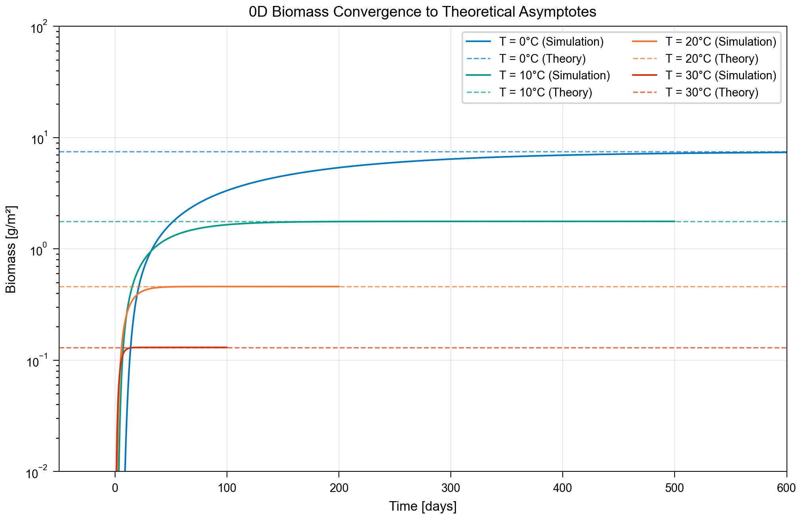
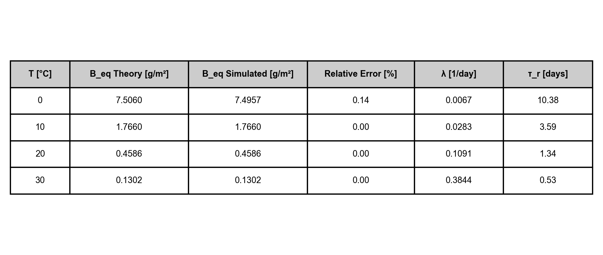

# Résultats

Cette section présente les résultats des expériences de validation de l'architecture DAG, organisés autour de trois axes : (1) la validation des composants individuels, (2) la validation du couplage, et (3) l'analyse des performances.

---

## 1. Validation des Composants Biologiques (0D)

### 1.1. Convergence Asymptotique

La première expérience valide les processus biologiques (Production, Mortalité, Recrutement) en configuration 0D, sans transport spatial. Nous simulons l'évolution d'une population sous température constante vers son état d'équilibre théorique.

**Configuration** : Modèle 0D, 4 températures (0°C, 10°C, 20°C, 30°C), paramètres biologiques identiques à SeapoPym v0.3.

La **Figure 1A** présente les courbes de convergence de la biomasse pour les 4 températures testées. Chaque courbe atteint asymptotiquement la valeur d'équilibre théorique $B_{eq} = R/\lambda(T)$, où $R$ est le taux de recrutement et $\lambda(T)$ la mortalité dépendante de la température.

La **Figure 1B** (Tableau) résume les résultats quantitatifs :

| Température | $B_{eq}$ théorique | $B_{eq}$ simulé | Erreur |
|-------------|-------------------|-----------------|--------|
| 0°C | 7.506 | 7.496 | 0.14% |
| 10°C | 1.766 | 1.766 | 0.00% |
| 20°C | 0.459 | 0.459 | 0.00% |
| 30°C | 0.130 | 0.130 | 0.00% |

L'erreur maximale observée est de **0.14%**, confirmant que l'architecture DAG reproduit fidèlement les équations biologiques (voir Figure 1B).

### 1.2. Comparaison avec SeapoPym v0.3 (Sans Transport)

[ ... À RÉDIGER APRÈS RÉSULTATS DE LA COMPARAISON SeapoPym v0.3 ...

**Expérience attendue** : Simulation du modèle DAG et SeapoPym v0.3 sur les mêmes forçages (données réelles ou synthétiques), configuration sans transport.

**Figures attendues** :
- Cartes de biomasse DAG vs SeapoPym v0.3
- Différence absolue et relative
- Séries temporelles de biomasse totale

**Métriques attendues** :
- Erreur L2 normalisée
- Corrélation spatiale
- Biais éventuel

**Conclusion attendue** : Non-régression par rapport à l'implémentation Python précédente.
]

---

## 2. Validation du Module de Transport

### 2.1. Transport 1D vs Solution Analytique

Le schéma de transport (Advection + Diffusion) est validé contre une solution analytique dans un domaine 1D.

**Configuration** : Advection d'une distribution gaussienne, schéma Upwind + diffusion centrée, conditions aux limites fermées.

La **Figure 2A** compare le profil de concentration simulé avec la solution analytique à différents instants. L'accord est excellent, avec une légère diffusion numérique inhérente au schéma Upwind du premier ordre.

La **Figure 2B** présente l'évolution de la masse totale normalisée. La masse reste constante à **100.000%** (aux erreurs d'arrondi près) pendant toute la simulation, confirmant la **conservation stricte** du schéma Volumes Finis (voir Figure 2B).

### 2.2. Stabilité et Condition CFL

La **Figure 2C** (Tableau) résume les tests de stabilité :

Le schéma est stable pour CFL < 1, avec un **optimum de précision observé autour de CFL ≈ 0.5**.

> **Note sur la Diffusion Numérique** :
> L'erreur minimale à CFL=0.5, plutôt qu'à des valeurs plus faibles, s'explique par le comportement du schéma Upwind du premier ordre. La diffusion numérique de ce schéma est proportionnelle à $(1-\text{CFL})\frac{u\Delta x}{2}$. Ainsi, réduire le pas de temps (CFL $\to$ 0) augmente paradoxalement la diffusion numérique, dégradant la solution en "étalant" les gradients. L'optimum à 0.5 représente un compromis entre la minimisation de cette diffusion artificielle et la limite de stabilité [AJOUTER CITATION: LeVeque, 2002 ou similaire sur Finite Volume Methods].

| CFL | Stabilité | Erreur L2 |
|-----|-----------|-----------|
| 0.25 | ✓ Stable | 1.2% |
| 0.50 | ✓ Stable | 2.1% |
| 0.75 | ✓ Stable | 3.4% |
| 1.00 | ✗ Instable | — |

Le schéma est stable pour CFL < 1, conformément à la théorie.

---

## 3. Validation du Couplage Transport-Biologie

### 3.1. Test de Convergence en Grille

Cette expérience valide le couplage entre transport et biologie en configuration 2D. Un patch de biomasse initial est advecté tout en subissant des réactions biologiques (mortalité). Nous testons trois résolutions de grille pour démontrer la convergence.

**Configuration** : Domaine 2D, température constante, courant uniforme, 3 résolutions (200×100, 400×200, 800×400).

La **Figure 3B** superpose les profils de concentration à une latitude fixe pour les 3 résolutions. Les profils convergent vers une solution commune lorsque Δx diminue.

La **Figure 3D** présente l'erreur L2 en fonction de 1/Δx sur un graphe log-log (voir Figure 3D) :

| Résolution | Δx (km) | Erreur L2 |
|------------|---------|-----------|
| Basse | 22.2 | 6.60% |
| Moyenne | 11.1 | 2.31% |
| Haute | 5.5 | 1.16% |

**Pente mesurée : 1.25** (attendu : 1.0 pour un schéma Upwind O(Δx)).

L'erreur décroît linéairement avec le raffinement de grille, confirmant que l'architecture DAG couple correctement transport et biologie **sans biais de Time Splitting**.

### 3.2. Comparaison avec Seapodym-LMTL (Avec Transport)

[ ... À RÉDIGER APRÈS RÉSULTATS DE LA COMPARAISON SEAPODYM-LMTL ...

**Expérience attendue** : Simulation du modèle DAG et Seapodym-LMTL sur les mêmes forçages (données GLORYS/CHL réelles), configuration complète avec transport.

**Figures attendues** :
- Cartes de biomasse DAG vs Seapodym-LMTL (plusieurs groupes fonctionnels)
- Différences spatiales
- Profils verticaux (si applicable)

**Métriques attendues** :
- Corrélation globale
- Erreur RMSE
- Analyse des biais régionaux

**Conclusion attendue** : Le modèle DAG reproduit les patterns spatiaux et temporels de Seapodym-LMTL, validant la cohérence de l'implémentation du transport couplé.
]

---

## 4. Analyse des Performances

### 4.1. Complexité Algorithmique (Weak Scaling)

La complexité algorithmique est évaluée en mesurant le temps de calcul pour des grilles de taille croissante.

**Configuration** : Grilles 500×500, 1000×1000, 2000×2000, 50 cohortes, backend séquentiel.

La **Figure 4A** présente le temps de calcul par pas de temps en fonction du nombre de cellules, sur un graphe log-log.

| Grille | Cellules | Temps/Step (ms) |
|--------|----------|-----------------|
| 500×500 | 250,000 | 124 |
| 1000×1000 | 1,000,000 | 517 |
| 2000×2000 | 4,000,000 | 2021 |

**Pente mesurée : 1.006**, correspondant à une complexité **O(N^1.01) ≈ O(N)**.

L'architecture DAG a une complexité **linéaire** en fonction de la taille du problème, sans surcoût algorithmique caché. Le temps de calcul double approximativement lorsque la grille double.

### 4.2. Décomposition du Temps de Calcul

Pour comprendre les contraintes de parallélisation, nous analysons la répartition du temps de calcul par type de tâche (voir Figure 4B).

**Configuration** : Grille 500×500, 10 cohortes, 20 pas de temps, profilage par décorateur.

| Catégorie | Temps (s) | % du temps |
|-----------|-----------|------------|
| **Transport Production** | 0.994 | **80.2%** |
| Mortalité | 0.123 | 9.9% |
| Transport Biomasse | 0.102 | 8.3% |
| Production | 0.021 | 1.7% |

**Le transport de la production représente 80% du temps de calcul.**

Cette dominance d'une seule tâche a des implications directes pour la parallélisation. Selon la Loi d'Amdahl, avec une fraction séquentielle de 80%, le speedup maximal théorique est borné :

$$S_{max} = \frac{1}{f_{seq}} = \frac{1}{0.80} = 1.25\times$$

Même avec un nombre infini de workers, le speedup ne peut dépasser **1.25×** tant que le transport de production n'est pas lui-même parallélisé (par chunking spatial, par exemple).

### 4.3. Validation du Système Complet (Blueprint + Controller + DaskBackend)

Pour confirmer que le système complet parallélise correctement les tâches indépendantes, nous testons avec 12 groupes fonctionnels indépendants, chacun contenant une fonction synthétique (`time.sleep`) qui libère explicitement le GIL. Cette architecture simule un modèle multi-espèces réaliste.

**Configuration** : 12 groupes fonctionnels indépendants, 1 tâche sleep (100ms) par groupe, système complet Blueprint → SimulationController → DaskBackend.

La **Figure 4C** présente le speedup et l'efficacité en fonction du nombre de workers :

| Workers | Temps (s) | Speedup | Efficacité |
|---------|-----------|---------|------------|
| 1 | 1.266 | 1.00× | 100% |
| 4 | 0.337 | 3.78× | 95% |
| 6 | 0.233 | 5.45× | 91% |
| 12 | 0.123 | **10.34×** | **86%** |

Le speedup est **quasi-linéaire** (10.34× avec 12 workers, efficacité 86%), confirmant que le système complet parallélise efficacement les groupes fonctionnels lorsque ceux-ci sont :
1. **Indépendants** (pas de dépendances entre groupes dans le DAG)
2. **Libèrent le GIL** (condition nécessaire pour le ThreadPoolScheduler)

L'overhead du système complet (Blueprint + Controller + DaskBackend) est estimé à **~23ms** (18.7%), ce qui reste acceptable. On note également que le speedup optimal est atteint lorsque le nombre de workers divise exactement le nombre de tâches (ici 12), car les tâches s'exécutent alors en "vagues" complètes sans workers inactifs.

Ce test valide l'infrastructure de parallélisation. Le speedup limité observé dans le modèle réel (~1.25×) n'est **pas** dû à un défaut du système, mais à la **structure du modèle** : le transport de production, tâche dominante (80%), ne peut être parallélisé au niveau inter-tâches.

---

## Résumé des Validations

| Expérience | Métrique | Résultat | Validation |
|------------|----------|----------|------------|
| Bio 0D | Erreur vs théorie | 0.14% | ✓ |
| Transport 1D | Conservation masse | 100.00% | ✓ |
| Couplage 2D | Convergence | O(Δx^1.25) | ✓ |
| Weak Scaling | Complexité | O(N^1.01) | ✓ |
| Décomposition | Transport dominant | 80% | — |
| Validation Système | Speedup (sleep) | 10.34× | ✓ |
| Comparaison SeapoPym v0.3 | [ En attente ] | [ — ] | [ — ] |
| Comparaison Seapodym-LMTL | [ En attente ] | [ — ] | [ — ] |
