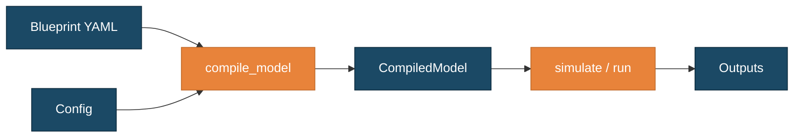
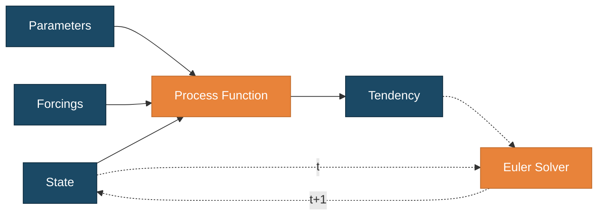
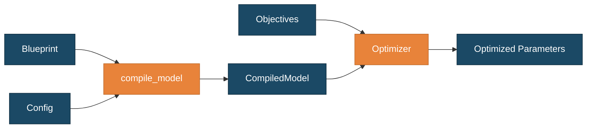

# SeapoPym


[](https://codecov.io/gh/Ash12H/SeapoPym-JAX)


[](https://github.com/astral-sh/ruff)
[](https://github.com/astral-sh/uv)


**SeapoPym** is a JAX-accelerated framework for Eulerian population dynamics on N-dimensional grids. Models are declared as YAML blueprints (DAG of processes), compiled into optimized JAX graphs, and executed on CPU or GPU.

- **For scientists** — Explicit numerical schemes, YAML model declaration, strict unit validation (Pint), visual process DAG.
- **For ML engineers** — Pure JAX backend, end-to-end differentiable, GPU/TPU support, built-in optimization (Optax, CMA-ES, GA).

## Installation

```bash
pip install git+https://github.com/Ash12H/SeapoPym-JAX.git
```

With GPU support:
```bash
pip install "git+https://github.com/Ash12H/SeapoPym-JAX.git[gpu]"
```

For development:
```bash
git clone https://github.com/Ash12H/SeapoPym-JAX.git
cd SeapoPym-JAX
uv sync --all-extras
```

## Simulation pipeline

A model is declared as a YAML blueprint and configured with concrete data. The compiler validates units and shapes, then produces a `CompiledModel` ready for execution:



At each timestep, the process DAG (solid arrows) computes tendencies from state, parameters and forcings. An explicit Euler solver (dashed arrows) then integrates the tendencies to advance the state:



## Optimization

Parameter calibration builds on the same Blueprint + Config base. Two additional components are needed: **Objectives** (observed data + loss metric) and an **Optimizer** (calibration strategy):



Three methods are available: **Gradient descent** (Optax), **Genetic Algorithm** and **CMA-ES** (evosax). Gradient-based optimization leverages JAX's automatic differentiation; evolutionary methods work without gradients.

## Documentation

Full documentation, conceptual guides, and runnable examples are available at:

**[https://ash12h.github.io/SeapoPym-JAX/](https://ash12h.github.io/SeapoPym-JAX/)**

## Contributing

See [CONTRIBUTING.md](CONTRIBUTING.md) for development setup and guidelines.

## License

[MIT](LICENSE) — Jules Lehodey, 2024
