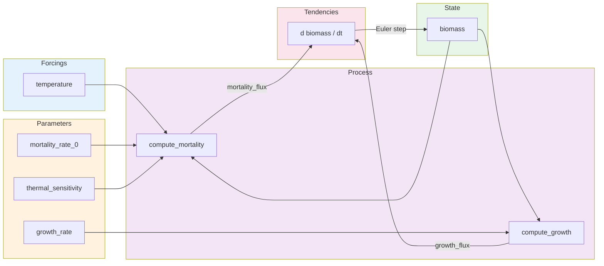
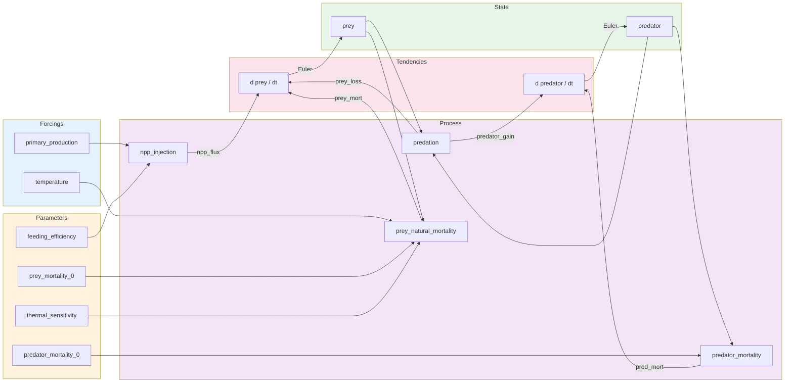
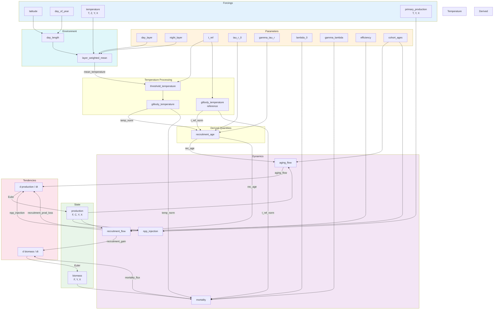

# Blueprint & DAG

A **Blueprint** is the core abstraction of SeapoPym. It declares *what* a model computes — its variables, process steps, and how results feed back into state — without providing any concrete data.

## What is a Blueprint?

A Blueprint is a YAML file with three sections:

1. **Declarations** — All variables: state, parameters, forcings, and derived intermediates.
2. **Process** — An ordered list of computation steps, forming a Directed Acyclic Graph (DAG).
3. **Tendencies** — How derived fluxes contribute to state variable updates (Euler integration).

```yaml
id: my-model
version: "1.0"

declarations:
  state:
    biomass:
      units: "g/m^2"
      dims: [Y, X]
  parameters:
    growth_rate:
      units: "1/s"
  forcings:
    temperature:
      units: "degC"
      dims: [T, Y, X]

process:
  - func: "mylib:compute_growth"
    inputs:
      biomass: state.biomass
      rate: parameters.growth_rate
      temp: forcings.temperature
    outputs:
      return: derived.growth_flux

tendencies:
  biomass:
    - source: derived.growth_flux
```

!!! info "Separation of concerns"
    A Blueprint defines the **topology** (which functions, which connections). The **Config** provides concrete data (parameter values, forcing arrays, time range). One Blueprint can be run with many different Configs.

## The Process DAG

Each process step declares:

- **func** — A registered function (format `namespace:function_name`)
- **inputs** — Maps function arguments to variable paths (e.g., `state.biomass`, `forcings.temperature`)
- **outputs** — Maps function return values to derived variables

The engine executes steps in order. Each step reads from state, parameters, forcings, or previously computed derived variables, and writes to new derived variables.

### Example 1: Growth and Temperature-Dependent Mortality

The simplest meaningful ecosystem model: biomass grows at a constant rate and dies at a temperature-dependent rate.



**YAML for this model:**

```yaml
process:
  - func: "eco:compute_growth"
    inputs:
      biomass: state.biomass
      rate: parameters.growth_rate
    outputs:
      return: derived.growth_flux

  - func: "eco:compute_mortality"
    inputs:
      biomass: state.biomass
      temp: forcings.temperature
      lambda_0: parameters.mortality_rate_0
      gamma: parameters.thermal_sensitivity
    outputs:
      return: derived.mortality_flux

tendencies:
  biomass:
    - source: derived.growth_flux       # positive contribution
    - source: derived.mortality_flux    # negative contribution (function returns negative values)
```

### Example 2: Predator-Prey

Two interacting species: prey grows from primary production, predator feeds on prey.



Key differences from Example 1:

- **Two state variables** (prey, predator) with separate tendency accumulators.
- **Predation** is a multi-output function: it produces both a loss for prey and a gain for predator.
- The DAG remains acyclic within a timestep — feedback happens through the Euler integration loop.

### Example 3: SeapoPym LMTL (No Transport)

The full LMTL (Low and Mid Trophic Levels) model without spatial transport. This is the `seapodym_lmtl_no_transport` blueprint shipped with SeapoPym.

Two state variables track the ecosystem:

- **production** — Cohort-structured primary production (dims: F, C, Y, X). New production enters cohort 0 from NPP, ages through cohorts, and recruits to biomass.
- **biomass** — Aggregated biomass per functional group (dims: F, Y, X). Fed by recruitment, depleted by mortality.



**Key observations:**

- **Cohort structure** — Production has a C (cohort) dimension. NPP enters at cohort 0, aging shifts production between cohorts, and recruitment transfers mature cohorts to biomass.
- **DVM (Diel Vertical Migration)** — The `layer_weighted_mean` function combines day and night depth layers based on `day_length`, simulating organisms that migrate between depths.
- **Temperature chain** — Raw temperature is depth-averaged (DVM), thresholded, then normalized via Gillooly's formula before being used in recruitment age and mortality calculations.
- **Multi-output functions** — `recruitment_flow` returns both a production loss and a biomass gain, connecting two state variables.

## The @functional Decorator

Physics functions are registered using the `@functional` decorator, which attaches metadata for validation and automatic vectorization:

```python
from seapopym.blueprint import functional

@functional(
    name="lmtl:mortality",
    units={
        "biomass": "g/m^2",
        "temp": "delta_degC",
        "lambda_0": "1/s",
        "gamma": "1/delta_degC",
        "t_ref": "delta_degC",
        "return": "g/m^2/s",
    },
)
def mortality(biomass, temp, lambda_0, gamma, t_ref):
    """Temperature-dependent natural mortality."""
    return -lambda_0 * jnp.exp(gamma * (temp - t_ref)) * biomass
```

The decorator stores:

| Metadata | Purpose |
|----------|---------|
| `name` | Unique identifier (`namespace:function`), referenced in YAML |
| `units` | Expected Pint units per argument + return value |
| `core_dims` | Dimensions the function operates on (not broadcast) |
| `out_dims` | Dimensions added by the function |
| `outputs` | Names for multi-output functions (tuple returns) |

**Unit validation** happens at compile time: the compiler verifies that all units in the process chain are consistent, catching errors like passing meters where seconds are expected.

## Tendencies and Euler Integration

The `tendencies` section maps state variables to their flux sources:

```yaml
tendencies:
  biomass:
    - source: derived.mortality_flux      # negative (loss)
    - source: derived.recruitment_gain    # positive (gain)
  production:
    - source: derived.npp_injection       # positive (source)
    - source: derived.aging_flow          # redistribution between cohorts
    - source: derived.recruitment_prod_loss  # negative (loss to biomass)
```

At each timestep, the engine applies **explicit Euler integration**:

$$
\text{state}_{t+1} = \max\left(\text{state}_t + \sum_i \text{source}_i \times \Delta t,\; 0\right)
$$

The clamping to zero ensures physical non-negativity (e.g., biomass cannot go below zero).

## Pre-defined Blueprints

SeapoPym ships with two reference blueprints:

| Blueprint | Description | State Variables | Process Steps |
|-----------|-------------|-----------------|---------------|
| `LMTL_NO_TRANSPORT` | LMTL ecosystem without spatial movement | biomass, production | 10 |
| `LMTL` | Full LMTL with Zalesak advection/diffusion | biomass, production | 17 |

```python
from seapopym.models import LMTL_NO_TRANSPORT, LMTL

# Or load by name
from seapopym.models import load_model
blueprint = load_model("seapodym_lmtl_no_transport")
```

## Loading Custom Blueprints

```python
from seapopym.blueprint import Blueprint

# From YAML file
blueprint = Blueprint.load("my_model.yaml")

# From Python dict
blueprint = Blueprint.from_dict({
    "id": "my-model",
    "version": "1.0",
    "declarations": {...},
    "process": [...],
    "tendencies": {...},
})
```
