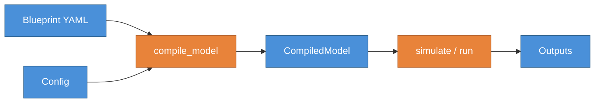
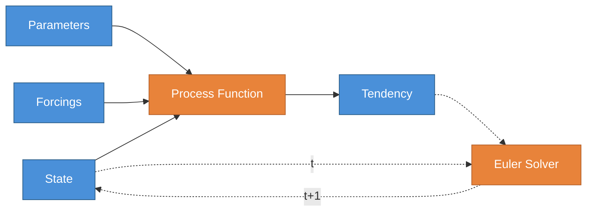
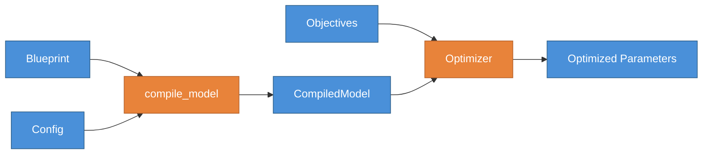

# SeapoPym

**SeapoPym** is a JAX-accelerated framework for Eulerian population dynamics on N-dimensional grids.

It uses a **DAG-based blueprint architecture** where biological and physical processes (movement, growth, mortality) are declared as connected nodes with flux edges. Models are defined in YAML, compiled into optimized JAX computation graphs, and executed on CPU or GPU.

## Why SeapoPym?

SeapoPym bridges two communities:

=== "For Scientists"

    - **Explicit numerical schemes** — Euler integration, finite-volume transport (Zalesak), no black-box solvers.
    - **Visual DAG of processes** — Each computation step is a named node with declared inputs, outputs, and units.
    - **YAML-based model declaration** — Define your model topology without writing code. Swap processes, add forcings, change resolution.
    - **Strict validation** — Pint-based unit checking, dimension consistency, NaN rejection — all at compile time.

=== "For ML Engineers"

    - **Pure JAX backend** — `jax.lax.scan` for time loops, full JIT compilation, GPU/TPU support.
    - **End-to-end differentiable** — Compute gradients through the entire simulation via `jax.grad`.
    - **Automatic vectorization** — `jax.vmap` dispatches over non-core dimensions with canonical ordering.
    - **Built-in optimization** — Gradient descent (Optax), CMA-ES, Genetic Algorithm, IPOP-CMA-ES (evosax).

## Key Features

- **Blueprint Architecture** — Declare models as YAML: state variables, parameters, forcings, and process DAG.
- **Strict Unit Validation** — Pint-based dimensional consistency enforced at compile time.
- **Automatic Vectorization** — `vmap` dispatch over non-core dimensions with canonical ordering `(E, T, F, C, Z, Y, X)`.
- **Pluggable Writers** — WriterRaw (JAX-traceable for optimization), MemoryWriter (`xr.Dataset`), DiskWriter (Zarr).
- **Flexible Forcings** — Lazy loading with temporal interpolation (`linear`, `nearest`, `ffill`).
- **Optimization** — Gradient descent (Optax), CMA-ES, Genetic Algorithm, IPOP-CMA-ES (evosax).

## Simulation Pipeline

A model is declared as a YAML blueprint and configured with concrete data. The compiler validates units and shapes, then produces a `CompiledModel` ready for execution:



At each timestep, the process DAG (solid arrows) computes tendencies from state, parameters and forcings. An explicit Euler solver (dashed arrows) then integrates the tendencies to advance the state:



## Optimization

Parameter calibration builds on the same Blueprint + Config base. Two additional components are needed: **Objectives** (observed data + loss metric) and an **Optimizer** (calibration strategy):



Three methods are available: **Gradient descent** (Optax), **Genetic Algorithm** and **CMA-ES** (evosax). Gradient-based optimization leverages JAX's automatic differentiation; evolutionary methods work without gradients.

## Quickstart

```python
from seapopym.models import LMTL_NO_TRANSPORT
from seapopym.blueprint import Config
from seapopym.compiler import compile_model
from seapopym.engine import simulate
import xarray as xr
import numpy as np

# 1. Load a pre-defined blueprint
blueprint = LMTL_NO_TRANSPORT

# 2. Configure the experiment
config = Config.from_dict({
    "parameters": {"growth_rate": {"value": 0.01}, ...},
    "forcings": {"temperature": xr.DataArray(...)},
    "initial_state": {"biomass": xr.DataArray(...)},
    "execution": {"time_start": "2020-01-01", "time_end": "2020-12-31", "dt": "1d"},
})

# 3. Compile and run
model = compile_model(blueprint, config)
state, outputs = simulate(model, chunk_size=365)

# outputs is an xr.Dataset with the exported variables
print(outputs)
```

## Next Steps

- [Installation](getting-started/installation.md) — Set up SeapoPym on your machine.
- [Blueprint & DAG](concepts/blueprint.md) — Understand how models are declared.
- [Examples](examples/01_lmtl_no_transport.ipynb) — Run your first simulation.
