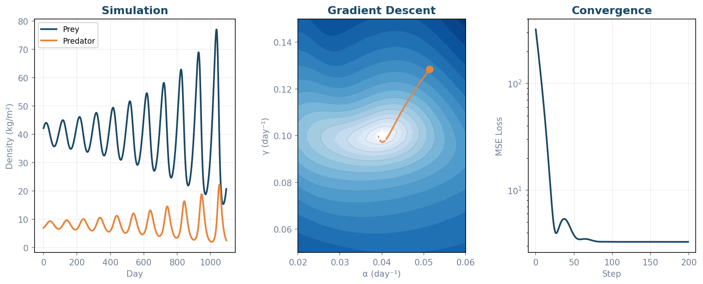
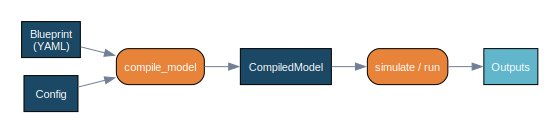
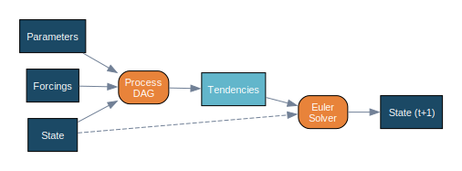
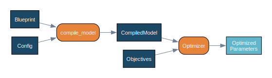

# SeapoPym

**SeapoPym** is a JAX-accelerated framework for differentiable simulation of dynamical systems on N-dimensional grids.

It uses a **[Directed Acyclic Graph](https://en.wikipedia.org/wiki/Directed_acyclic_graph) (DAG) blueprint architecture** where biological and physical processes (movement, growth, mortality) are declared as connected nodes with flux edges. Models are defined in YAML, compiled into optimized JAX computation graphs, and executed on CPU or GPU.



!!! example "Lotka-Volterra prey-predator"

    A classic 2-species ODE (prey growth α, predation β, conversion δ, mortality γ) declared as a SeapoPym Blueprint and compiled to JAX. **Gradient Descent** recovers α and γ from partial, noisy observations (prey only, 5% Gaussian noise) by back-propagating through the entire simulation via `jax.grad` — converging to <1% error in ~100 steps.

## Why SeapoPym?

SeapoPym bridges two communities:

=== "For Scientists"

    - **Explicit numerical schemes** — Euler integration, first-order upwind finite volume for transport — no black-box solvers.
    - **Visual DAG of processes** — Each computation step is a named node with declared inputs, outputs, and units.
    - **YAML-based model declaration** — Define your model topology without writing code. Swap processes, add forcings, change resolution.
    - **Strict validation** — Pint-based unit checking, dimension consistency, NaN rejection — all at compile time.

=== "For ML Engineers"

    - **Pure JAX backend** — `jax.lax.scan` for time loops, full JIT compilation, GPU/TPU support.
    - **End-to-end differentiable** — Compute gradients through the entire simulation via `jax.grad`.
    - **Automatic vectorization** — `jax.vmap` dispatches over non-core dimensions with canonical ordering.
    - **Built-in optimization** — Gradient descent (Optax), CMA-ES, Genetic Algorithm, IPOP-CMA-ES (evosax).

## How it works

Define a model in YAML, compile it, run it. The same pipeline supports simulation and parameter optimization.

_Fig. 1 — From YAML blueprint to simulation output. The compiler validates units and shapes at compile time._



_Fig. 2 — At each timestep, the DAG computes tendencies from state, parameters and forcings. An Euler solver advances the state._



_Fig. 3 — Same pipeline, extended with objectives and an optimizer for automatic parameter calibration._



## Quickstart

Logistic growth — `dN/dt = r·N·(1 − N/K)` — in 20 lines:

```python
import numpy as np
import xarray as xr
from seapopym.blueprint import Blueprint, Config, functional
from seapopym.compiler import compile_model
from seapopym.engine import simulate

# 1. Define the physics — one equation, two parameters
@functional(name="logistic", units={"N": "kg/m^2", "r": "1/s", "K": "kg/m^2", "return": "kg/m^2/s"})
def logistic_growth(N, r, K):
    return r * N * (1 - N / K)

# 2. Declare the model
blueprint = Blueprint.from_dict({
    "id": "logistic", "version": "1.0",
    "declarations": {
        "state": {"N": {"units": "kg/m^2", "dims": ["Y", "X"]}},
        "parameters": {"r": {"units": "1/s"}, "K": {"units": "kg/m^2"}},
        "forcings": {},
    },
    "process": [{"func": "logistic", "inputs": {"N": "state.N", "r": "parameters.r", "K": "parameters.K"}, "outputs": {"return": "derived.growth"}}],
    "tendencies": {"N": [{"source": "derived.growth"}]},
})

# 3. Configure, compile, run
DAY = 86400.0
config = Config.from_dict({
    "parameters": {"r": xr.DataArray(0.05 / DAY), "K": xr.DataArray(100.0)},
    "forcings": {},
    "initial_state": {"N": xr.DataArray(np.array([[1.0]]), dims=["Y", "X"])},
    "execution": {"time_start": "2000-01-01", "time_end": "2000-12-31", "dt": "1d"},
})
model = compile_model(blueprint, config)
_, outputs = simulate(model)

# 4. Result — logistic saturation toward K=100
N = outputs["N"].values[:, 0, 0]
print(f"Day 0: {N[0]:.0f} → Day 90: {N[90]:.0f} → Day 180: {N[180]:.0f} → Day 365: {N[-1]:.0f}")
# Day 0: 1 → Day 90: 47 → Day 180: 99 → Day 365: 100
```

## Next step

[Build a dynamical system from scratch](examples/01_lotka_volterra.ipynb) — Define a Lotka-Volterra model, compile it, and simulate predator-prey dynamics.
